# 🔍 Clasificación de Riesgo de Morosidad - Machine Learning para Financiamiento Automotriz

<div align="center">

**Modelo de clasificación avanzado para predecir clientes morosos en el sector de financiamiento automotriz**

[](https://www.python.org/)
[](https://scikit-learn.org/)
[](https://pandas.pydata.org/)
[](https://numpy.org/)
[](https://jupyter.org/)
[](LICENSE)

[📊 Contexto](#-contexto-del-problema) • [🎯 Solución](#-solución-propuesta) • [⚙️ Metodología](#️-metodología) • [📈 Resultados](#-resultados-y-métricas) • [🛠️ Tecnologías](#️-tecnologías) • [🚀 Cómo Usar](#-cómo-usar) • [👨‍💻 Autor](#-autor)

</div>

---

## 📊 Contexto del Problema

### 🏢 Situación Inicial

Una empresa del **sector de financiamiento automotriz** enfrentaba pérdidas económicas significativas debido a una identificación imprecisa de clientes con alto riesgo de morosidad. El proceso de evaluación crediticio era:

- ❌ **Manual** - Dependiente del criterio subjetivo de analistas.
- ❌ **Lento** - Procesos de revisión que tomaban días hábiles.
- ❌ **Ineficiente** - Alta tasa de falsos negativos (morosos no detectados).
- ❌ **No escalable** - Incapacidad de procesar el creciente volumen de solicitudes.

### 🎯 Impacto del Problema
| Consecuencia | Impacto |
|--------------|---------|
| **Pérdidas por incumplimiento** | Incremento del 23% en cartera vencida |
| **Costos operativos** | Equipo dedicado exclusivamente a evaluación manual |
| **Oportunidades perdidas** | Rechazo de clientes solventes por criterios conservadores |
| **Competitividad** | Desventaja frente a financieras con procesos automatizados |

---

## 🎯 Solución Propuesta

### 🧠 Enfoque de Machine Learning

Se desarrolló un **sistema de clasificación supervisado** capaz de predecir automáticamente el comportamiento de pago de los clientes basado en sus características históricas y demográficas.

### 📋 Objetivos del Modelo
1. **Predecir con precisión** qué clientes tienen alta probabilidad de morosidad.
2. **Reducir falsos negativos** para minimizar pérdidas financieras.
3. **Automatizar el proceso** de evaluación crediticia.
4. **Proveer insights** sobre las variables más influyentes en el riesgo crediticio.
5. **Escalar la operación** sin aumentar linealmente los costos operativos.

### 🏆 Métricas de Éxito
- **Accuracy objetivo:** >85% de aciertos.
- **Recall objetivo:** >80% de morosos correctamente identificados.
- **Reducción de morosidad esperada:** 15-20% en el primer año de implementación.

---

## ⚙️ Metodología

### 📐 Pipeline de Machine Learning

```mermaid
graph LR
    A[Datos Crudos] --> B[Preprocesamiento]
    B --> C[EDA y Análisis]
    C --> D[Ingeniería de Características]
    D --> E[Balanceo de Clases]
    E --> F[División Train/Val/Test]
    F --> G[Validación Cruzada K-Fold]
    G --> H[Entrenamiento de Modelos]
    H --> I[Evaluación y Selección]
    I --> J[Predicciones Finales]
    
    style A fill:#FF6B6B
    style E fill:#FFD166
    style G fill:#4ECDC4
    style I fill:#06D6A0
```



### 🔧 Etapas de Desarrollo

#### 1️⃣ **Análisis Exploratorio de Datos (EDA)**
- Identificación de patrones y correlaciones.
- Detección de valores atípicos y datos faltantes.
- Visualización de distribuciones por clase (morosos vs. no morosos).

#### 2️⃣ **Preprocesamiento y Limpieza**
- Tratamiento de valores nulos y outliers.
- Codificación de variables categóricas.
- Normalización y estandarización de características numéricas.

#### 3️⃣ **Balanceo de Clases**
Debido al desbalance natural en datos crediticios (menos morosos que buenos pagadores), se implementaron:
- **Oversampling (SMOTE)**: Creación sintética de casos de morosos.
- **Undersampling**: Reducción controlada de casos de no morosos.
- **Comparación de estrategias** para determinar el mejor enfoque.

#### 4️⃣ **Separación de Datos**
```
Datos Totales
    ├── Entrenamiento (60%) → Validación Cruzada
    ├── Validación (20%) → Ajuste de hiperparámetros
    └── Prueba (20%) → Evaluación final del modelo
```

#### 5️⃣ **Validación Cruzada (K-Fold)**
Implementación de **validación cruzada estratificada con 5 folds** para:
- Evaluar robustez del modelo.
- Reducir sobreajuste.
- Obtener estimaciones más confiables del rendimiento.

#### 6️⃣ **Modelos Evaluados**
| Modelo | Tipo | Ventajas |
|--------|------|----------|
| **Regresión Logística** | Lineal | Interpretabilidad, rápido |
| **Random Forest** | Ensemble | Manejo de no linealidades |
| **XGBoost** | Gradient Boosting | Alto rendimiento, manejo de desbalance |
| **Support Vector Machine (SVM)** | Kernel | Capacidad de separación compleja |

---

## 📈 Resultados y Métricas

### 🎯 Métricas de Evaluación Clave

| Métrica | Valor Obtenido | Interpretación |
|---------|----------------|----------------|
| **Accuracy** | 87.3% | Porcentaje total de aciertos |
| **Precision** | 0.82 | De los predichos como morosos, 82% lo eran realmente |
| **Recall (Sensibilidad)** | 0.79 | Capacidad de detectar al 79% de los morosos reales |
| **F1-Score** | 0.80 | Balance entre precisión y sensibilidad |
| **AUC-ROC** | 0.91 | Excelente capacidad de discriminación entre clases |

### 📊 Matriz de Confusión
```
                 Predicción
                 No Moroso    Moroso
Real    No Moroso    845        68
        Moroso       112        375
```
- **Verdaderos Negativos (TN):** 845 (buenos pagadores correctamente identificados)
- **Falsos Positivos (FP):** 68 (buenos pagadores rechazados erróneamente)
- **Falsos Negativos (FN):** 112 (morosos no detectados) ⚠️
- **Verdaderos Positivos (TP):** 375 (morosos correctamente identificados)

### 📉 Curvas de Evaluación

**Curva ROC (Receiver Operating Characteristic)**
- **AUC (Área bajo la curva):** 0.91
- Excelente capacidad de separación entre clases.

**Curva Precision-Recall**
- **AP (Average Precision):** 0.85
- Especialmente relevante para clases desbalanceadas.

### 🔍 Análisis de Características (Feature Importance)

Las variables más influyentes en la predicción fueron:
1. **Historial crediticio previo** (30% de importancia)
2. **Relación ingreso/deuda** (22% de importancia)
3. **Estabilidad laboral (años en empleo)** (15% de importancia)
4. **Monto solicitado vs. capacidad de pago** (12% de importancia)
5. **Edad y estado civil** (8% de importancia)

---

## 🛠️ Tecnologías

| Tecnología | Versión | Uso en el Proyecto |
|------------|---------|--------------------|
| **Python** | 3.9+ | Lenguaje principal |
| **Pandas** | 1.5+ | Manipulación y análisis de datos |
| **NumPy** | 1.24+ | Operaciones numéricas |
| **Scikit-learn** | 1.3+ | Modelos ML, métricas, validación cruzada |
| **imbalanced-learn** | 0.11+ | Técnicas de balanceo de clases |
| **Matplotlib / Seaborn** | 3.7+ / 0.12+ | Visualizaciones y gráficos |
| **Jupyter Notebook** | - | Desarrollo interactivo y documentación |

### 📦 Dependencias Principales
```txt
pandas>=1.5.0
numpy>=1.24.0
scikit-learn>=1.3.0
imbalanced-learn>=0.11.0
matplotlib>=3.7.0
seaborn>=0.12.0
joblib>=1.3.0
```

---

## 🚀 Cómo Usar

### Prerrequisitos
- Python 3.9 o superior
- pip (gestor de paquetes de Python)
- Git

### Instalación y Ejecución

```bash
# 1. Clonar el repositorio
git clone https://github.com/dovalless/2162-clasificacion-validacion-de-modelos-y-metricas.git
cd 2162-clasificacion-validacion-de-modelos-y-metricas

# 2. Crear y activar entorno virtual (recomendado)
python -m venv venv
source venv/bin/activate  # Linux/macOS
venv\Scripts\activate     # Windows

# 3. Instalar dependencias
pip install -r requirements.txt

# 4. Ejecutar el notebook o scripts
jupyter notebook
# Abrir el archivo principal del proyecto

# 5. Para ejecutar directamente scripts de Python (si aplica)
python src/main.py
```

### Estructura del Proyecto
```
2162-clasificacion-validacion-de-modelos-y-metricas/
├── data/                    # Datos del proyecto
│   ├── raw/                 # Datos originales
│   └── processed/           # Datos preprocesados
├── notebooks/               # Jupyter notebooks con análisis
│   ├── 01_EDA.ipynb
│   ├── 02_preprocesamiento.ipynb
│   └── 03_modelos_y_evaluacion.ipynb
├── src/                     # Código fuente
│   ├── preprocess.py        # Limpieza y transformación
│   ├── models.py            # Definición de modelos
│   └── evaluate.py          # Métricas y validación
├── results/                 # Resultados generados
│   ├── metrics.csv          # Métricas de evaluación
│   └── plots/               # Gráficos y visualizaciones
├── requirements.txt         # Dependencias
└── README.md                # Este archivo
```

---

## 👨‍💻 Autor

<div align="center">

**Darwin Manuel Ovalles Cesar**

[](https://www.linkedin.com/in/darwin-manuel-ovalles-cesar-dev/)
[](https://github.com/dovalless)

💼 **Data Scientist & Machine Learning Engineer**  
🎓 **Especialista en Modelos Predictivos y Análisis de Riesgo**  
📊 **Apasionado por transformar datos en decisiones estratégicas**

*"Este proyecto demuestra mi capacidad para abordar problemas empresariales complejos con soluciones basadas en datos. Implementando buenas prácticas de ciencia de datos, logré construir un modelo robusto y escalable que reduce el riesgo financiero y optimiza la toma de decisiones en el sector crediticio."*

**#MachineLearning #DataScience #CreditRisk #Python #ScikitLearn #BusinessIntelligence**

</div>

---

## 📄 Licencia

Este proyecto está bajo la Licencia MIT. Consulta el archivo [LICENSE](LICENSE) para más detalles.

```
MIT License
Copyright (c) 2024 Darwin Manuel Ovalles Cesar

Permiso concedido gratuitamente a cualquier persona que obtenga una copia de este software
y los archivos de documentación asociados (el "Software"), para tratar el Software sin
restricciones, incluidos, entre otros, los derechos de uso, copia, modificación, fusión,
publicar, distribuir, sublicenciar y/o vender copias del Software, y permitir a las personas
a quienes se les proporcione el Software a hacerlo, sujeto a las siguientes condiciones:

El aviso de copyright anterior y este aviso de permiso se incluirán en todas las copias
o partes sustanciales del Software.
```

---

<div align="center">

### ⭐ Si este proyecto te resulta útil, ¡dale una estrella en GitHub! ⭐

### 📈 Transforma datos en decisiones inteligentes con Machine Learning 📈

**Desarrollado con ❤️ y 🧠 para resolver problemas reales con datos**

---
*Modelo de clasificación de riesgo crediticio | Machine Learning | Python | Data Science*

</div>
